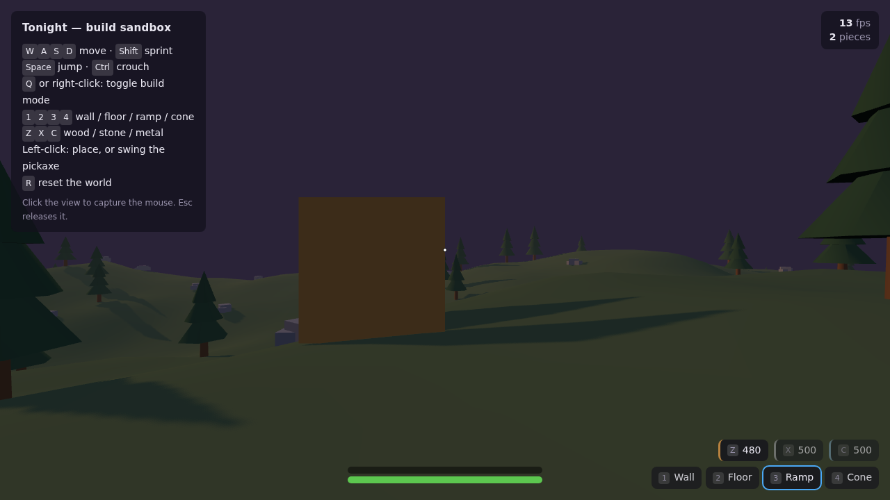

# Tonight

**Tonight** is an open-source battle royale that runs in a browser, built with
**three.js** and **TypeScript**, with art generated procedurally in **Blender**.

30 players. One shrinking storm. Harvest, build, fight, survive until morning.



> **Status: playable sandbox.** You can walk over generated terrain, harvest
> trees and rocks, and build walls, floors, ramps and cones on the grid — with a
> preview ghost, structural collapse, and the build-HP ramp that makes a fresh
> wall killable. It is not yet a match: no combat against other players, no
> storm running live, no networking.
>
> 150 simulation tests run in under a second, and CI drives the built game in a
> headless browser on every push. See [docs/03-roadmap.md](docs/03-roadmap.md).

## Play it

```bash
cd web
npm install
npm run dev          # then open http://localhost:5173
```

| | |
| --- | --- |
| `W A S D` | move · `Shift` sprint · `Space` jump · `Ctrl` crouch |
| `Q` / right-click | toggle build mode |
| `1 2 3 4` | wall / floor / ramp / cone |
| `Z X C` | wood / stone / metal |
| Left-click | place a piece, or swing the pickaxe |
| `R` | reset the world |

## Why this repo looks the way it does

Four decisions shape everything here. Read these before reading code.

### 1. "Blueprints" means data, not code

The project brief asked to *prefer Blueprints* — an Unreal feature that exists
in neither Unity nor three.js. Tonight implements the idea rather than the
feature: **content is authored as data, not as code.**

Every weapon, build piece, loot table, storm phase and rarity tier is an entry
in `web/data/*.json`. A designer adds a weapon by editing JSON. **No code
change, no rebuild step, no programmer.** If adding content to a system requires
editing TypeScript, that system is considered unfinished — it is checked in
review and asserted by tests.

This survived the move off Unity intact, and got better: JSON is diffable in
review, needs no `.meta` sidecar, has no GUID identity to break on rename, and
needs no generator step.

### 2. The simulation does not know the renderer exists

`web/src/gameplay/` imports no three.js and touches no DOM. It runs in Node, in
tests, and will run unchanged on a server. Only `web/src/render/` knows about
the browser.

That boundary is what makes 150 tests run headless in under a second, and it is
what will make the authoritative server possible without a rewrite.

### 3. Art is generated by script, not modelled by hand

Every mesh in `blender/scripts/` comes from a deterministic Python generator
that runs headless in Blender. Re-running a generator reproduces the same mesh,
so art is reviewable in a diff and regenerable in CI.

### 4. It has to actually run

The project spent its first phase as a Unity codebase that was never once
compiled — 11,500 lines of C# and 215 tests that could not execute. Two real
bugs were sitting in it, one with a test written for it that never ran.

[ADR-0007](docs/adr/0007-threejs-instead-of-unity.md) records that decision
honestly. The rule that came out of it: **if CI cannot run it, it is not done.**

## Repository layout

```
Tonight/
├── docs/               Design and technical documentation (start here)
│   ├── 00-vision.md              What the game is, and is not
│   ├── 01-game-design-document.md The GDD
│   ├── 02-technical-architecture.md
│   ├── 03-roadmap.md             Milestones with hard exit criteria
│   ├── adr/                      Architecture Decision Records
│   ├── systems/                  One spec per gameplay system
│   ├── blueprints/               The data-authoring contract
│   ├── pipeline/                 Art pipeline: units, naming, generators
│   └── mcp/                      Driving Blender over MCP
│
├── web/                The game
│   ├── data/                     Blueprint JSON: all game content
│   ├── src/core/                 Grid, RNG, math. No engine, no DOM.
│   ├── src/blueprints/           Schema, registry, validation
│   ├── src/gameplay/             The simulation. Imports no three.js.
│   ├── src/render/               three.js scene, collision, HUD
│   ├── tests/                    150 tests, headless
│   └── tools/smoke.mjs           Drives the built game in a real browser
│
└── blender/            Procedural art generation
    ├── lib/tonight/              Generator library (runs without Blender)
    ├── scripts/                  One generator per asset family
    └── exports/                  glTF output (gitignored; regenerate)
```

## Verify it

Everything below runs with no GPU, no Blender, and no engine licence.

```bash
cd web
npm run verify       # typecheck + 227 tests + production build
npm run smoke        # drive the built game in headless Chromium

cd ..
python3 -m pip install -r tools/requirements.txt
python3 -m pytest blender/tests -q                            # 136 art tests
python3 blender/scripts/build_all.py --dry-run                # all 34 meshes, no files
python3 blender/scripts/build_all.py                          # real glTF export
```

## Contributing

Read [CONTRIBUTING.md](CONTRIBUTING.md). The rule that matters most: **new
content goes in JSON, not in TypeScript.**

## License

MIT — see [LICENSE](LICENSE).

Tonight is an independent project. It is not affiliated with, endorsed by, or
derived from the code or assets of Epic Games or *Fortnite*. All art in this
repository is generated by the scripts in `blender/`.
